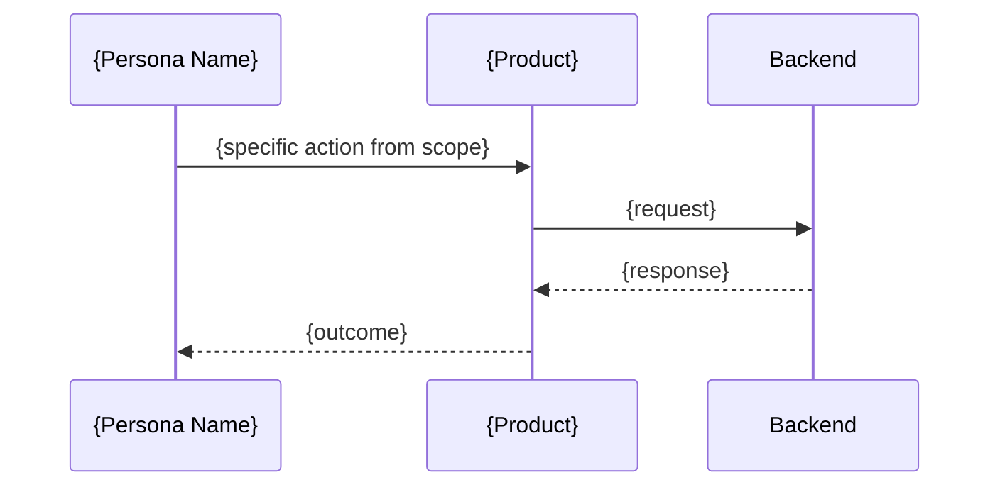

# User Stories — Personas, Flows & Wireframes

Generate user personas from scope lock, map key journey flows as mermaid sequence diagrams, and
build a navigable wireframe prototype in vanilla HTML/CSS.

## Arguments

- `$SCOPE_LOCK_PATH` - Path to scope-lock.md (required)

---

## Phase 0: Guard

Check that scope has been locked before proceeding.

```bash
source ~/.claude/scripts/lib/scope-guard.sh
require_locked_scope "$SCOPE_LOCK_PATH"
PLAN_DIR=$(dirname "$SCOPE_LOCK_PATH")
```

**Gate 0:** `.locks/scope-lock.md.locked` exists in plan directory. Error if missing:
"Run /plan:scope first to lock scope."

---

## Phase 1: Load Scope

Read `$SCOPE_LOCK_PATH` and extract:

- **Target Users** — specific roles, not generic "users"
- **v1 Must-Do** — the one thing the product must accomplish
- **Domain** — explicit boundary (what's in, what's out)
- **Differentiator** — why this over competitors
- **Features to Steal** — competitive features to incorporate

Store these as working context for Phases 2–4.

---

## Phase 2: Personas

Generate 2–3 user personas derived from scope lock Target Users.

Each persona includes:

| Field | Description |
|-------|-------------|
| **Name** | Realistic name reflecting the audience |
| **Role** | Job title or relationship to the product |
| **Goals** | What they want to accomplish (2–3 bullets) |
| **Pain Points** | Current frustrations without this product (2–3 bullets) |
| **Technical Comfort** | Scale: non-technical / comfortable / power user |

Personas must be distinct — each represents a different relationship with the product. Avoid
overlapping goals between personas.

---

## Phase 3: User Flows

Create the top 3–5 user flows as mermaid sequence diagrams.

Each flow represents a key journey through the product from a specific persona's perspective:

- Map the happy path first, then note failure/edge-case branches
- Include system actors (API, DB, external services) where relevant
- Label interactions with real action names from scope lock (not generic "clicks button")
- Cover the v1 Must-Do journey as the first flow



Ensure flows cross-reference personas — at least one flow per persona.

---

## Phase 4: Wireframes

> For a lightweight layout sketch that lives inside the spec/PR rather than a navigable
> prototype, the `ascii-wireframe` skill renders box-drawing wireframes as plain text (embeds
> in markdown, no browser). Use the HTML prototype below when navigation/interactivity matters.

Generate wireframes as a minimal HTML/CSS app:

### Requirements

- **Working navigation** between ALL obviously-required pages (derived from user flows)
- **Skeleton/placeholder content** — use real labels from scope lock, NOT Lorem Ipsum
- **Responsive** — mobile + desktop breakpoints
- **Vanilla HTML/CSS only** — no framework, no JavaScript dependencies
- **Consistent layout** — shared header/nav/footer across pages

### Output Structure

```
docs/plan/{name}/wireframes/
  index.html          (navigation hub — links to all pages)
  pages/*.html        (one file per page/screen)
  styles.css          (shared styles, responsive breakpoints)
```

### Page Derivation

Pages are derived from user flows in Phase 3:

| Flow Step | Wireframe Page |
|-----------|---------------|
| Entry point / landing | `index.html` |
| Each distinct screen in flows | `pages/{screen-name}.html` |
| Settings / profile mentioned | `pages/settings.html` |
| Admin views (if in scope) | `pages/admin-{view}.html` |

### Wireframe Style

- Gray/neutral palette (wireframe aesthetic, not branded)
- Placeholder boxes for images with dimension labels
- Real form labels, button text, and navigation items from scope lock
- Visible page structure: header, main content area, sidebar (if applicable), footer

---

## Phase 5: Write Output

### Artifacts

1. **User stories document:**
   Write `docs/plan/{name}/user-stories.md` containing:
   - Personas (from Phase 2)
   - Mermaid sequence diagrams (from Phase 3)
   - Page inventory table mapping flows to wireframe pages

2. **Wireframe prototype:**
   Write files to `docs/plan/{name}/wireframes/` (from Phase 4)

3. **Lock marker:**
   Create `$PLAN_DIR/.locks/user-stories.md.locked`

**Gate 5:** All files written. Lock marker created.

---

## Skills Referenced

| Skill | When Used |
|-------|-----------|
| `mermaid-diagrams` | Sequence diagram syntax and best practices |
| `frontend-design` | Wireframe layout, responsive breakpoints |

---

## Output

```
plan:user-stories complete

Personas: {N} ({persona names})
User Flows: {N} mermaid sequence diagrams
Wireframe Pages: {N} pages

Artifacts:
  docs/plan/{name}/user-stories.md
  docs/plan/{name}/wireframes/index.html
  docs/plan/{name}/wireframes/pages/*.html
  docs/plan/{name}/wireframes/styles.css
  .locks/user-stories.md.locked

Next:
  /plan:financials {scope-lock-path}   Financial projections
  /plan:design {scope-lock-path}       Brand identity + design tokens
  /plan:prd {plan-dir-path}            Accumulate into PRD
```
